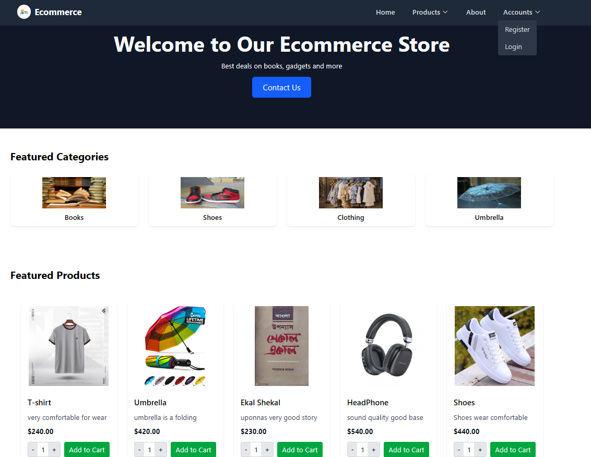

# 🛒 Pro-Commerce: Full-Stack E-commerce Solution

A clean, professional, and scalable e-commerce web application built with Python and the Django framework. This project features a complete user journey from authentication to product management and shopping cart functionality.

## 📸 Project Showcase
*Add your best project screenshots here to grab attention.*

## 🚀 Key Features
- **User Authentication:** Secure registration, login, and logout system using Django's built-in Auth framework.
- **Dynamic Product Catalog:** Browse products by category with detailed individual product pages.
- **Shopping Cart System:** Fully functional 'Add to Cart' logic with real-time item quantity updates and price calculations.
- **User Profiles:** Personalized user dashboards to manage account details and view order history.
- **Responsive UI:** Optimized for all screen sizes (Mobile, Tablet, Desktop) using modern CSS frameworks.

## 🛠️ Tech Stack
- **Backend:** Python, Django
- **Frontend:** HTML5, CSS3, Tailwind CSS / Bootstrap
- **Database:** SQLite (Development) / PostgreSQL (Ready)
- **Security:** CSRF Protection, Password Hashing, and Secure Session Management

## ⚙️ Installation & Setup
Follow these steps to run the project locally: